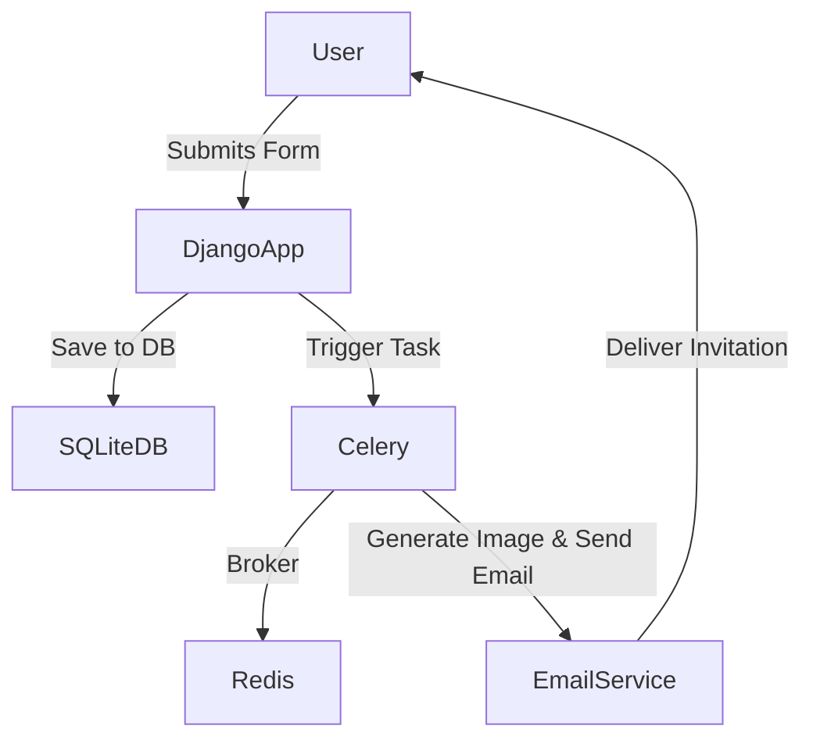

# RegFlow-Django-Celery 🌐🚀  

**A streamlined Django-based registration flow powered by Celery for asynchronous task management.**

---

## 📖 Overview  
RegFlow-Django-Celery is a Django project that integrates Celery and Redis to handle asynchronous tasks like personalized email invitations with embedded registration tokens. This project demonstrates a practical implementation of background task execution in a Django application.  

---

## 🎨 Architecture  



---
## 🎥Video
[](https://youtu.be/qZWaMfKl_qg)


---

## 🚀 Installation  

### Prerequisites  
Ensure you have the following installed:  
- Python 3.8+
- Redis  
- Django 5.x  
- Virtualenv (optional but recommended)  

### Steps  

1. **Clone the Repository**  
   ```bash
   git clone https://github.com/Caio-Felice-Cunha/RegFlow-Django-Celery.git
   cd RegFlow-Django-Celery
   ```  

2. **Set Up Virtual Environment**  
   ```bash
   python -m venv venv
   source venv/bin/activate  # On Windows: venv\Scripts\activate
   ```  

3. **Install Dependencies**  
   ```bash
   pip install -r requirements.txt
   ```  

4. **Configure Redis**  
   Make sure Redis is installed and running. Update the `CELERY_BROKER_URL` in `regflow/settings.py` if necessary.  

5. **Apply Migrations**  
   ```bash
   python manage.py migrate
   ```  

6. **Run Redis**  
   Start your Redis server:  
   ```bash
   redis-server
   ```  

7. **Start Celery Worker**  
   Open a new terminal and run:  
   ```bash
   celery -A regflow worker --loglevel=info
   ```  

8. **Run the Application**  
   ```bash
   python manage.py runserver
   ```  

9. **Access the Application**  
   Visit [http://127.0.0.1:8000](http://127.0.0.1:8000) in your browser.  

---

## 🛠 Usage  

1. Navigate to the homepage and fill out the registration form.  
2. Upon submission, Celery processes the request asynchronously to:  
   - Save the user’s data in the database.  
   - Generate a personalized invitation image.  
   - Send the invitation to the user’s email.  

---

## 🤝 Contributing  

Contributions are welcome! Follow these steps to contribute:  

1. **Fork the Repository**  
   Fork the project repository on GitHub.  

2. **Clone Your Fork**  
   ```bash
   git clone https://github.com/your-username/RegFlow-Django-Celery.git
   ```  

3. **Set Up Development Environment**  
   Follow the installation steps above.  

4. **Create a Feature Branch**  
   ```bash
   git checkout -b feature/your-feature-name
   ```  

5. **Make Your Changes**  
   Ensure your changes are well-tested.  

6. **Submit a Pull Request**  
   Push your changes and open a pull request on the main repository.  

---

## ⚠️ Known Issues  

- Celery worker startup might throw errors if Redis is not running.  
- No real email backend configuration for production; default is console email backend.  

---

## 🌟 Future Plans  

- Add support for other brokers like RabbitMQ.  
- Implement a production-ready email service using Gmail/SMTP.  
- Create a Docker container for easier deployment.  

---

## 📜 License  

This project is licensed under the [MIT License](LICENSE).  

---

## 🙌 Acknowledgments  

Special thanks to the Django and Celery communities for their robust tools and frameworks, enabling seamless development of asynchronous workflows.  

---  
Feel free to open issues or reach out for support at [caiofcunha@hotmail.com](mailto:caiofcunha@hotmail.com).  
